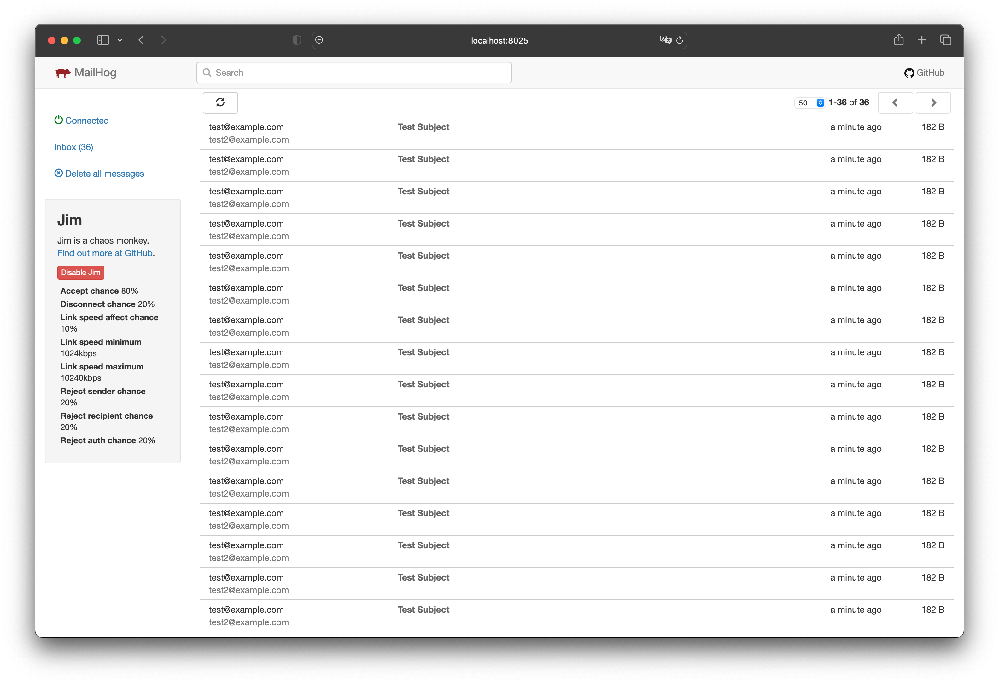

# How to trigger SMTP server errors using the JIM extension for MailHog.

I'll show you how to run a [MailHog](https://hub.docker.com/r/mailhog/mailhog/) local SMTP server in a Docker container with the [JIM extension](https://github.com/mailhog/MailHog/blob/master/docs/JIM.md) which will trigger errors when sending emails from a simple Python script.



### Prerequisites
- Docker Desktop
- [Miniconda](https://docs.conda.io/en/latest/miniconda.html) (optional)

### `Optional` Step 1 - Create a virtual environment
If you want to use a virtual environment, you can create one with the following commands:
```bash
# Download latest Miniconda https://docs.conda.io/en/latest/miniconda.html for your OS

# Create a virtual environment
conda create -n mailhog-jim-python python=3.10
conda activate mailhog-jim-python
```

### Step 2 - Clone the repository and start Docker Compose
```bash
# Clone the repository
git clone https://github.com/garis-space/mailhog-jim-python.git
cd mailhog-jim-python

# Environment variables (edit as needed)
cp .env.example .env
```

MailHog use Jim chaos monkey extension to fail sending emails. You can configure the probability of failure in the `.env` file. Default value is 0.2 and it means that 20% of emails will be rejected.

```bash
# Start Docker Compose
docker compose up
```

### Step 3 - Run the Python script
```bash
# Run the Python script
python main.py
```

### Step 4 - Check the email in MailHog
Open your browser and go to [http://localhost:8025](http://localhost:8025) to see the email sent by the Python script.

### Step 5 - Stop Docker Compose
```bash
docker compose down
```

### Step 6 - `Optional` Delete the virtual environment
```bash
conda deactivate
conda remove -n mailhog-jim-python --all
```
